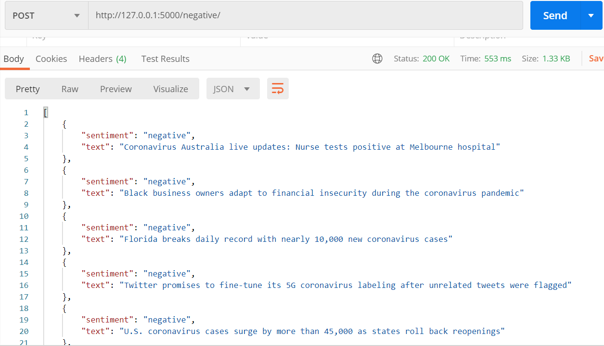

# SentimentAnalysisNewsAPI
Used python flask to create API endpoints to get positive, negative and neutral news

**Tech Stack**:
  * Python
  * Flask
  * News API
  * TextBlob

# Positive News API:

# Negative News API:

